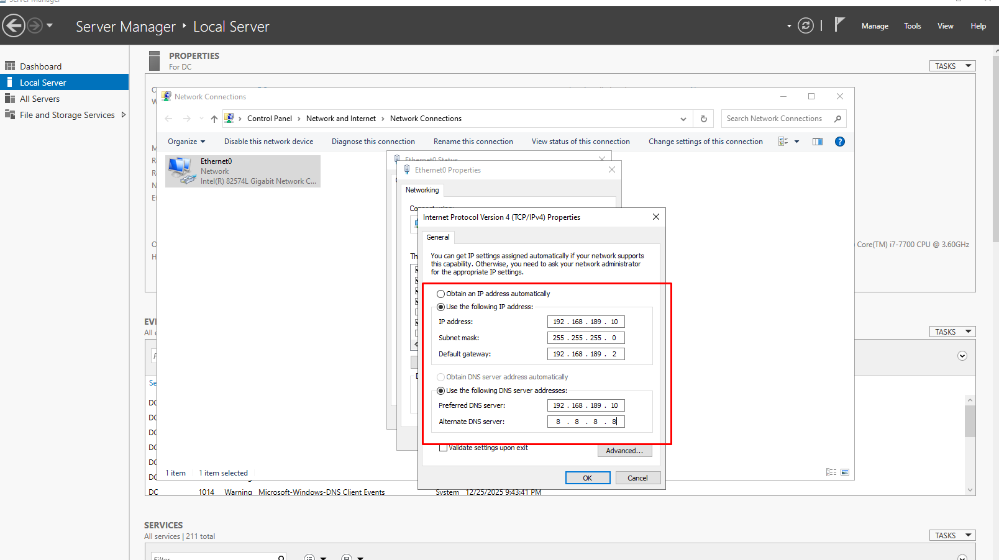
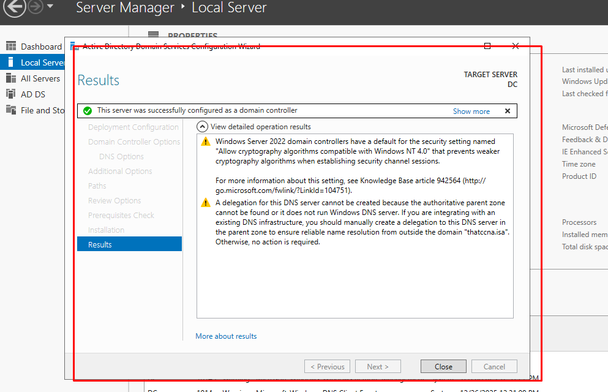
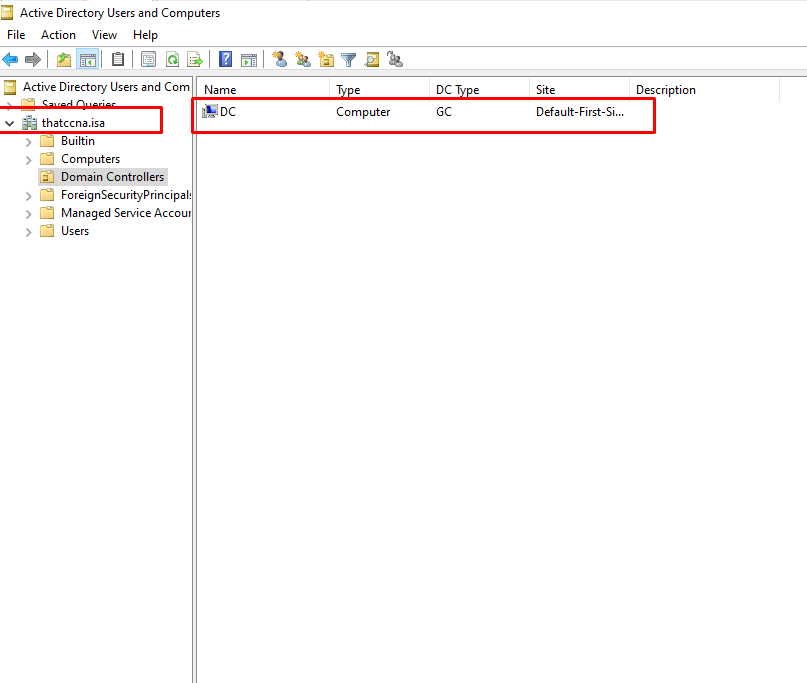
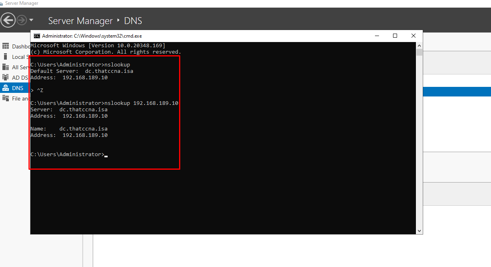
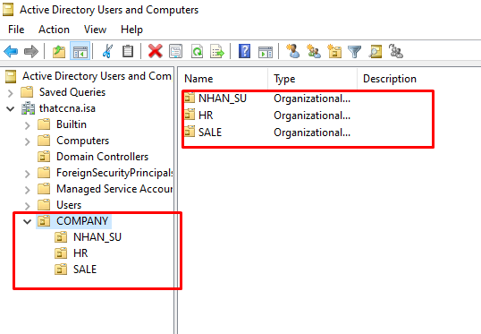
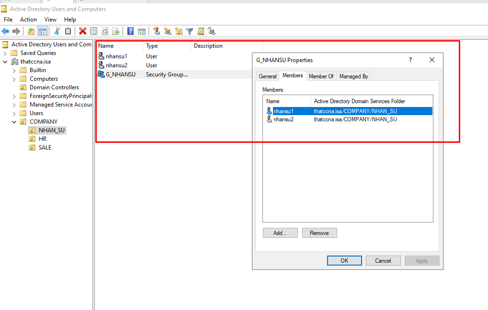
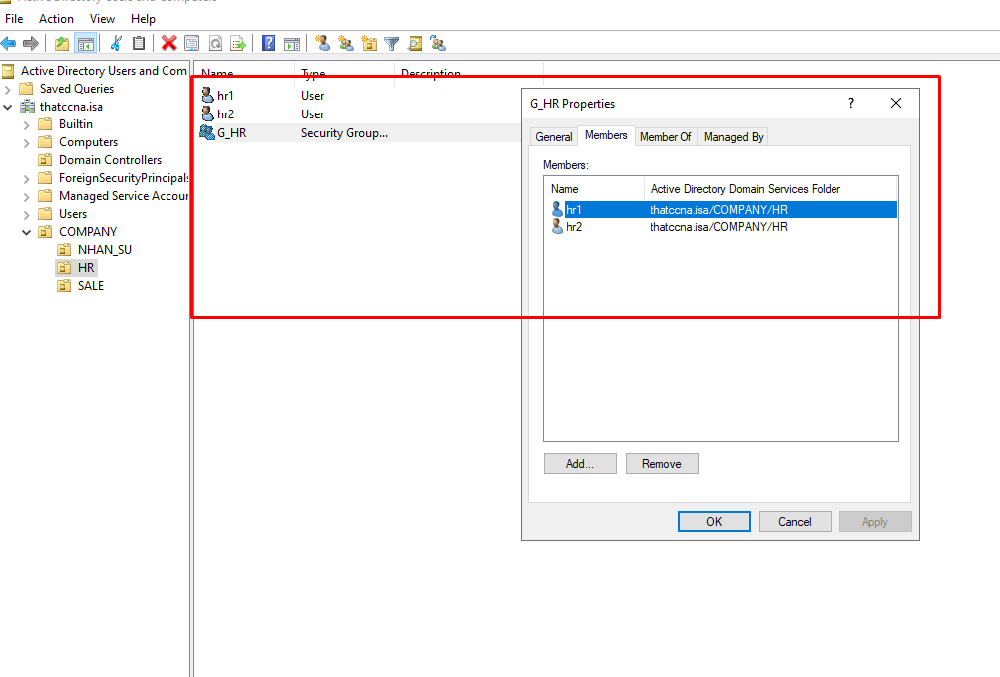
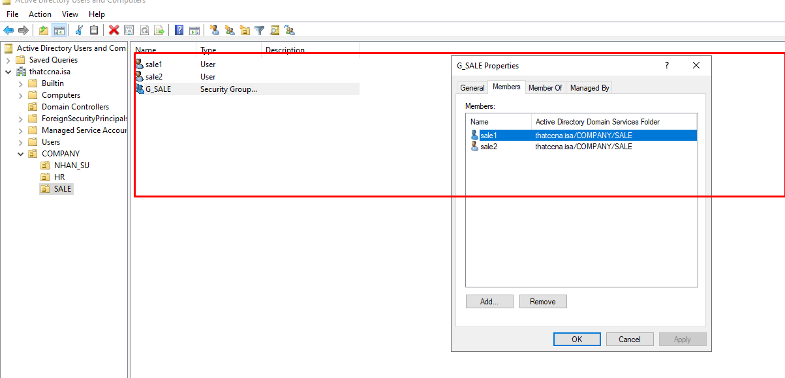
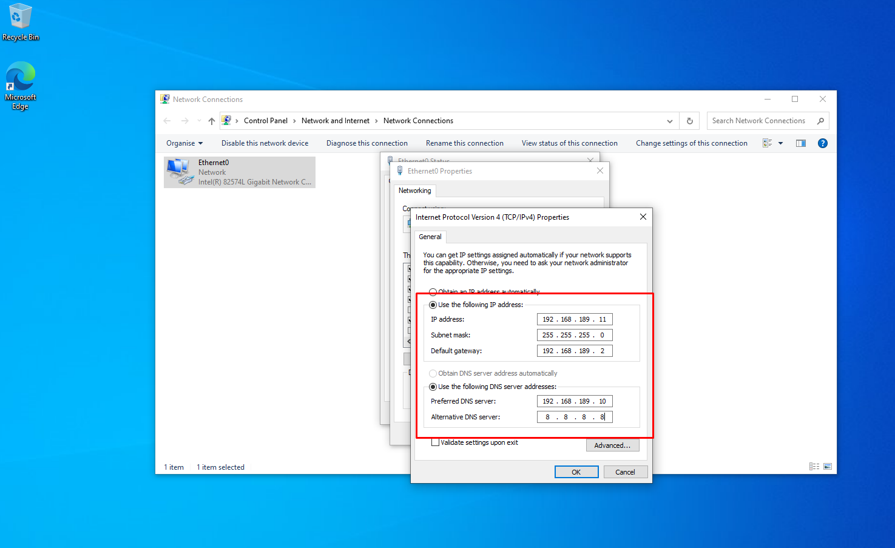
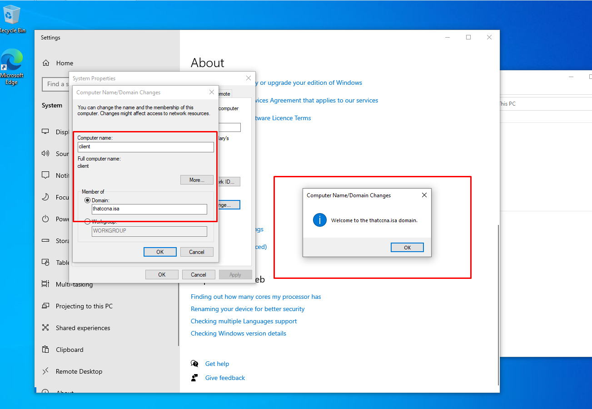

# Active Directory LAB – thatccna.isa

## 🎯 Mục tiêu
Triển khai hệ thống Active Directory cho doanh nghiệp mô phỏng 50–100 user.

## 🧱 Mô hình hệ thống
- Domain Controller: Windows Server 2022
- Client: Windows 10
- Domain: thatccna.isa
- IP DC: 192.168.189.10

## ⚙️ Các bước triển khai
1. Cấu hình IP tĩnh cho DC
2. Cài Active Directory Domain Services
3. Promote Domain Controller (thatccna.isa)
4. Cài đặt DNS Server
5. Tạo OU, User, Group
6. Cấu hình IP tĩnh cho client
7. Join domain cho client
8. Login user domain vào client

## 1️⃣ Cấu hình IP tĩnh cho Domain Controller

## 2️⃣ Cài đặt Active Directory Domain Services (AD DS)

## 3️⃣ Promote Domain Controller

### Cấu hình triển khai Domain

### Domain sau khi promote

## 4️⃣ Cài đặt và kiểm tra DNS

## 5️⃣ Tạo OU – User – Group

### Cấu trúc OU

### OU theo phòng ban

## 6️⃣ Cấu hình IP tĩnh cho Client

## 7️⃣ Client join domain thatccna.isa

## 8️⃣ Đăng nhập user domain trên Client

## ✅ Kết quả

Client đăng nhập domain **thatccna.isa** thành công.
